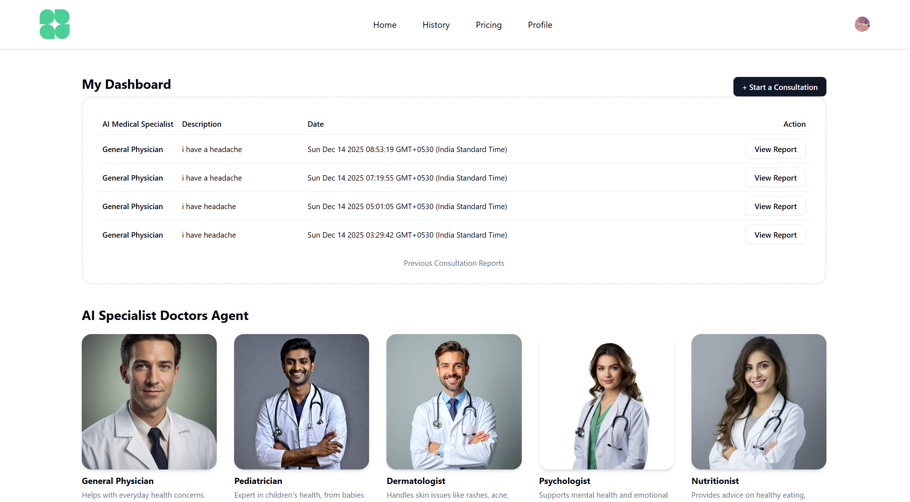

# AI-Medical-Voice-Agent

A full-stack AI-powered medical voice assistant built using Next.js, React, TypeScript, AssemblyAI, Clerk, and Neon DB. The application enables real-time voice-based interaction, converting patient speech into text, understanding symptoms using AI, and generating intelligent responses instantly.

The system integrates real-time speech-to-text, secure user authentication, and cloud-based database storage to ensure privacy, scalability, and performance. Designed as a SaaS-style application, it demonstrates the practical use of AI and voice technology in healthcare-oriented solutions.

## Demo

https://www.youtube.com/watch?v=S2sPK6ZVpMU

## Screenshots

## Features

Based on the codebase provided, here is a structured **Features** section ready for your `README.md` file.

## ✨ Features

* **🗣️ AI-Powered Voice Consultations**
    * Engage in real-time, natural voice conversations with AI medical agents powered by [Vapi](https://vapi.ai/) and OpenAI.
    * Experience low-latency interactions that feel like talking to a real doctor.

* **🩺 Intelligent Specialist Matching**
    * Automatically analyzes user-submitted symptoms and notes to recommend the most suitable specialist (e.g., Cardiologist, Dermatologist, Pediatrician).
    * Utilizes advanced LLMs to match patient needs with specific AI doctor personas.

* **🏥 Multi-Specialist Network**
    * Access a diverse range of AI specialists including:
        * **General Physician**: For primary care and common ailments.
        * **Cardiologist**: For heart health and blood pressure.
        * **Dermatologist**: For skin conditions and care.
        * **Pediatrician**: For child health and development.
        * **Psychologist**: For mental health support.
        * **Nutritionist**: For diet and weight management.

* **📝 Automated Medical Reports**
    * Generates comprehensive consultation reports immediately after the call ends.
    * Reports include structured data such as:
        * **Chief Complaint & Summary**
        * **Symptom Analysis** (Duration & Severity)
        * **Medications Mentioned**
        * **Actionable Recommendations**.

* **📜 Live Transcription & History**
    * View real-time transcripts of your conversation as it happens.
    * Access a complete history of all past consultations and view generated reports at any time from the dashboard.

* **🛡️ Secure Authentication**
    * Integrated with [Clerk](https://clerk.com/) for secure user sign-up, sign-in, and profile management.

* **⚡ Modern Tech Stack**
    * Built with **Next.js 15**, **React 19**, **TailwindCSS**, and **Drizzle ORM** for a fast, responsive, and type-safe experience.

